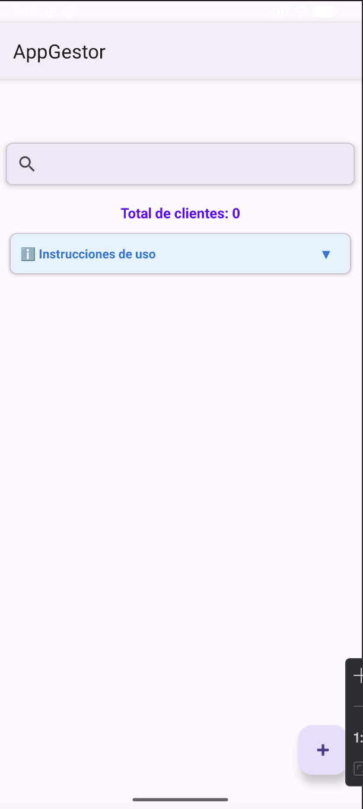
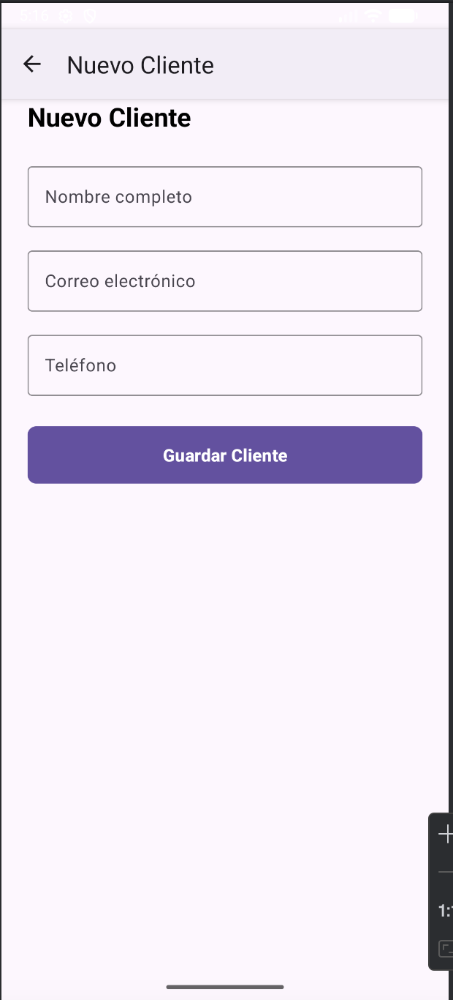
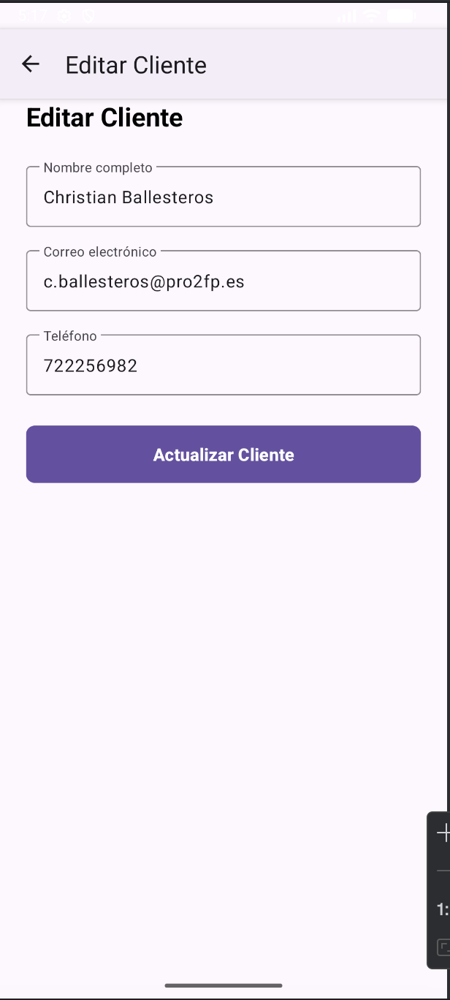
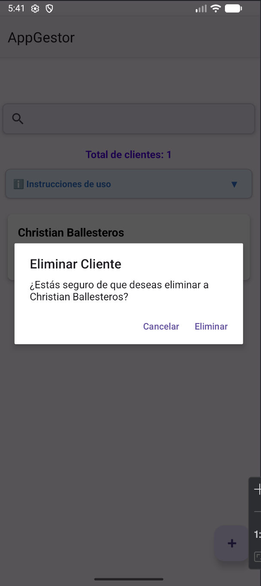
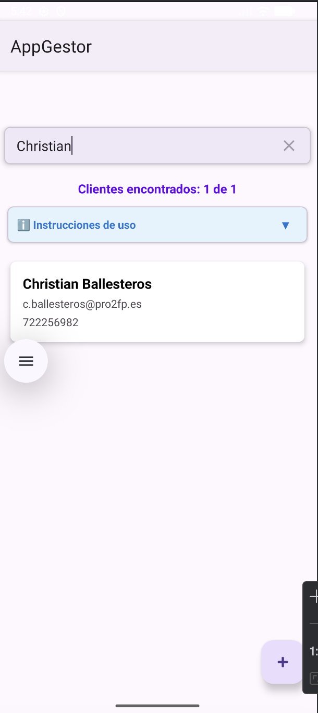

# Gestor de Clientes - Aplicación CRM Básica

Aplicación Android desarrollada en Kotlin para la gestión de clientes. Permite registrar, buscar, editar y eliminar información de clientes de manera sencilla y eficiente.

## 📋 Descripción del Proyecto

**Gestor de Clientes** es una aplicación móvil Android que implementa un CRUD completo (Create, Read, Update, Delete) para la gestión de clientes. El proyecto utiliza:
- **Lenguaje:** Kotlin
- **UI:** XML con Material Design Components
- **Persistencia:** SQLite con SQLiteOpenHelper
- **Arquitectura:** Patrón de diseño orientado a Activities y Adapters

---

## 🎯 Funcionalidades Principales

### ✅ Funcionalidades Básicas
- **Listar clientes:** Visualización de todos los clientes en un RecyclerView
- **Añadir cliente:** Formulario con validaciones para crear nuevos clientes
- **Editar cliente:** Modificación de datos existentes
- **Eliminar cliente:** Confirmación mediante AlertDialog antes de eliminar
- **Persistencia local:** Almacenamiento en base de datos SQLite

### ⭐ Funcionalidades Extras
- **Búsqueda en tiempo real:** Filtrado por nombre o correo mientras se escribe
- **Contador de clientes:** Visualización del total de clientes y resultados filtrados
- **Instrucciones colapsables:** Mensaje de ayuda para nuevos usuarios
- **Validaciones robustas:** 
  - Campos obligatorios
  - Formato de email correcto
  - Teléfono con mínimo 9 dígitos (solo números)

---

## 📱 Capturas de Pantalla

### Pantalla Principal
![Pantalla Principal]

- Lista de clientes con RecyclerView
- Búsqueda en tiempo real
- Contador de clientes
- Instrucciones colapsables
- FloatingActionButton para añadir clientes

### Formulario - Nuevo Cliente
![Nuevo Cliente]

- Campos con Material Design TextInputLayout
- Validaciones en tiempo real
- Botón de guardar

### Formulario - Editar Cliente
![Editar Cliente]

- Carga automática de datos del cliente
- Título dinámico según el modo
- Botón de actualizar

### Diálogo de Confirmación
![Eliminar Cliente]

- AlertDialog para confirmar eliminación
- Opciones de "Eliminar" y "Cancelar"

### Búsqueda Activa
![Búsqueda]

- Filtrado instantáneo mientras se escribe
- Contador dinámico de resultados

---

## 🗄️ Modelo de Datos

### Estructura de la Base de Datos

La aplicación utiliza SQLite con una única tabla llamada `clientes`:

```sql
CREATE TABLE clientes (
    id INTEGER PRIMARY KEY AUTOINCREMENT,
    nombre TEXT NOT NULL,
    correo TEXT NOT NULL,
    telefono TEXT NOT NULL
)
```

### Clase Cliente (Data Class)

```kotlin
data class Cliente(
    val id: Int = 0,
    val nombre: String,
    val correo: String,
    val telefono: String
)
```

**Atributos:**
- `id` (Int): Identificador único autoincremental
- `nombre` (String): Nombre completo del cliente
- `correo` (String): Dirección de correo electrónico
- `telefono` (String): Número de teléfono (mínimo 9 dígitos)

### DatabaseHelper

La clase `DatabaseHelper` extiende `SQLiteOpenHelper` y proporciona los siguientes métodos:

| Método | Descripción | Retorno |
|--------|-------------|---------|
| `insertarCliente(cliente: Cliente)` | Inserta un nuevo cliente | Long (ID generado) |
| `obtenerTodosLosClientes()` | Obtiene todos los clientes | List<Cliente> |
| `obtenerClientePorId(id: Int)` | Obtiene un cliente específico | Cliente? |
| `actualizarCliente(cliente: Cliente)` | Actualiza datos de un cliente | Int (filas afectadas) |
| `eliminarCliente(id: Int)` | Elimina un cliente | Int (filas eliminadas) |
| `contarClientes()` | Cuenta el total de clientes | Int |
| `buscarClientes(texto: String)` | Busca por nombre o correo | List<Cliente> |

---

## 🚀 Instrucciones de Instalación y Ejecución

### Requisitos Previos

- **Android Studio:** Hedgehog (2023.1.1) o superior
- **SDK mínimo:** API 24 (Android 7.0 Nougat)
- **SDK compilación:** API 34
- **Kotlin:** 1.9.0 o superior
- **Gradle:** 8.0 o superior

### Pasos para Abrir el Proyecto

1. **Clonar o descargar el proyecto**
   ```bash
   git clone <url-del-repositorio>
   ```
   O descargar el archivo ZIP y extraerlo.

2. **Abrir Android Studio**
   - Inicia Android Studio
   - Selecciona `File → Open`
   - Navega hasta la carpeta del proyecto
   - Selecciona la carpeta raíz (donde está el archivo `build.gradle`)
   - Haz clic en `OK`

3. **Sincronizar Gradle**
   - Android Studio sincronizará automáticamente las dependencias
   - Si no lo hace, haz clic en `File → Sync Project with Gradle Files`
   - Espera a que finalice la sincronización

4. **Configurar el dispositivo**
   
   **Opción A - Emulador:**
   - Ve a `Tools → Device Manager`
   - Crea un nuevo dispositivo virtual (AVD) si no tienes uno
   - Recomendado: Pixel 6 con API 34

   **Opción B - Dispositivo físico:**
   - Habilita las opciones de desarrollador en tu dispositivo Android
   - Activa la depuración USB
   - Conecta tu dispositivo por USB
   - Autoriza la conexión cuando aparezca el diálogo

5. **Ejecutar la aplicación**
   - Haz clic en el botón `Run` (▶️) o presiona `Shift + F10`
   - Selecciona tu dispositivo (emulador o físico)
   - Espera a que la aplicación se instale y se inicie

---

## 📂 Estructura del Proyecto

```
GestorClientes/
├── app/
│   ├── src/
│   │   ├── main/
│   │   │   ├── java/com/tuusuario/gestorclientes/
│   │   │   │   ├── Cliente.kt                    # Modelo de datos
│   │   │   │   ├── DatabaseHelper.kt             # Gestión de SQLite
│   │   │   │   ├── ClienteAdapter.kt             # Adapter del RecyclerView
│   │   │   │   ├── MainActivity.kt               # Pantalla principal
│   │   │   │   └── FormularioClienteActivity.kt  # Formulario de cliente
│   │   │   ├── res/
│   │   │   │   ├── layout/
│   │   │   │   │   ├── activity_main.xml
│   │   │   │   │   ├── activity_formulario_cliente.xml
│   │   │   │   │   └── item_cliente.xml
│   │   │   │   ├── values/
│   │   │   │   │   ├── strings.xml
│   │   │   │   │   ├── colors.xml
│   │   │   │   │   └── themes.xml
│   │   │   └── AndroidManifest.xml
│   └── build.gradle.kts
├── gradle/
├── capturas/
│   ├── pantalla_principal.png
│   ├── nuevo_cliente.png
│   ├── editar_cliente.png
│   ├── dialogo_eliminar.png
│   └── busqueda.png
└── README.md
```

---

## 🎨 Tecnologías y Librerías Utilizadas

| Tecnología | Versión | Uso |
|------------|---------|-----|
| Kotlin | 1.9.0+ | Lenguaje de programación |
| Android SDK | API 24-34 | Plataforma Android |
| Material Design Components | 1.11.0 | Componentes de UI |
| RecyclerView | 1.3.2 | Lista de clientes |
| CardView | 1.0.0 | Tarjetas de clientes |
| SQLite | Nativo | Base de datos local |
| ConstraintLayout | 2.1.4 | Layouts responsivos |

---

## 👤 Autor

**[TU NOMBRE AQUÍ]**
- Estudiante de 2º DAM
- Asignatura: Programación Multimedia y Dispositivos Móviles (PMDM)
- Centro: [Nombre de tu centro educativo]

---

## 📝 Notas de Desarrollo

### Patrones de Diseño Implementados
- **Adapter Pattern:** Para el RecyclerView de clientes
- **ViewHolder Pattern:** Para optimización del RecyclerView
- **Singleton Pattern:** En la instancia de DatabaseHelper

### Validaciones Implementadas
1. **Campos obligatorios:** No se permite guardar con campos vacíos
2. **Formato de email:** Validación mediante `Patterns.EMAIL_ADDRESS`
3. **Teléfono numérico:** Solo acepta dígitos (Regex: `^[0-9]+$`)
4. **Longitud de teléfono:** Mínimo 9 dígitos
5. **Mensajes de error:** En tiempo real sobre el campo correspondiente

### Interacciones Implementadas
- **Click normal:** Abre el formulario en modo edición
- **Click largo:** Muestra diálogo de confirmación para eliminar
- **SearchView:** Filtrado en tiempo real mientras se escribe
- **FloatingActionButton:** Añadir nuevo cliente
- **Navigation Up:** Flecha de retroceso en el ActionBar

---

## 🔄 Flujo de la Aplicación

```
Pantalla Principal (MainActivity)
    ↓
    ├─→ [FAB +] → Formulario Nuevo Cliente → Guardar → Volver a Principal
    ├─→ [Click Cliente] → Formulario Editar Cliente → Actualizar → Volver a Principal
    ├─→ [Long Click Cliente] → AlertDialog → Eliminar → Recargar Lista
    └─→ [SearchView] → Filtrar Lista en Tiempo Real
```

---

## 📄 Licencia

Este proyecto ha sido desarrollado con fines educativos para la asignatura de Programación Multimedia y Dispositivos Móviles (PMDM) del ciclo de Desarrollo de Aplicaciones Multiplataforma (DAM).

---

## 🐛 Problemas Conocidos

- Ninguno reportado actualmente

## 💡 Mejoras Futuras

- [ ] Exportar clientes a CSV
- [ ] Importar clientes desde archivo
- [ ] Añadir foto al cliente
- [ ] Llamar directamente desde la app
- [ ] Enviar email desde la app
- [ ] Backup en la nube
- [ ] Modo oscuro

---

## ✅ Checklist de Requisitos

### Requisitos Funcionales
- [x] RecyclerView con nombre, correo y teléfono
- [x] FloatingActionButton para añadir clientes
- [x] Formulario con EditText para nombre, email y teléfono
- [x] Validación de campos obligatorios
- [x] Validación de formato de email
- [x] Validación de teléfono (mínimo 9 dígitos)
- [x] Botón "Guardar" para insertar o actualizar
- [x] Persistencia con SQLite usando SQLiteOpenHelper
- [x] Permitir editar registros
- [x] Permitir eliminar registros
- [x] Cargar información automáticamente al iniciar
- [x] Búsqueda en tiempo real (filtro por nombre o correo)
- [x] Contador total de clientes
- [x] Confirmación con AlertDialog antes de borrar
- [x] README.md con instrucciones, capturas y modelo de datos

---

## 📞 Contacto

Para dudas o consultas sobre el proyecto:
- Email: [tu-email@ejemplo.com]
- GitHub: [tu-usuario-github]

---

**Fecha de última actualización:** Noviembre 2025

**Versión:** 1.0.0
